# Dev OS Telemetry Architecture

Visual guide to how development activity becomes weekly insights.

---

## The Big Picture

Your coding activity flows through three stages:

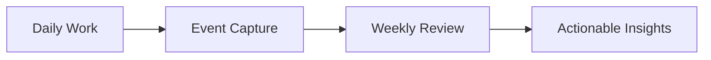

---

## Part 1: Event Capture

### How Events Are Created

Every tool use triggers a hook that emits an event:

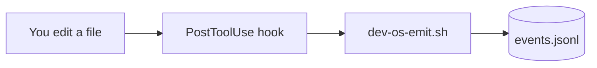

### The Central Event Stream

All events flow to one file:

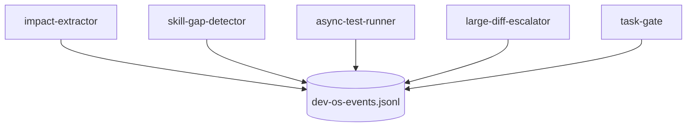

---

## Part 2: Event Types

### Code Change Events

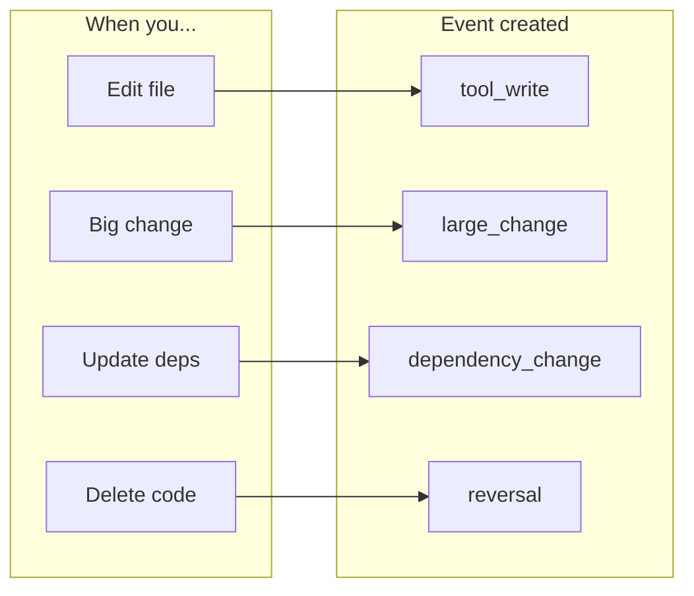

### Quality Signal Events

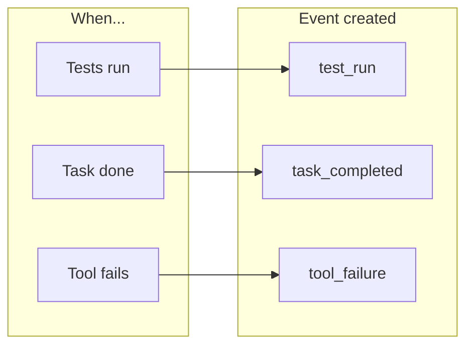

### Decision Events

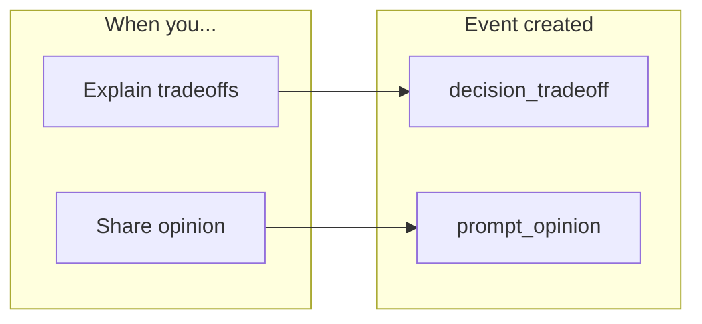

---

## Part 3: Storage Layout

### Primary Log Files

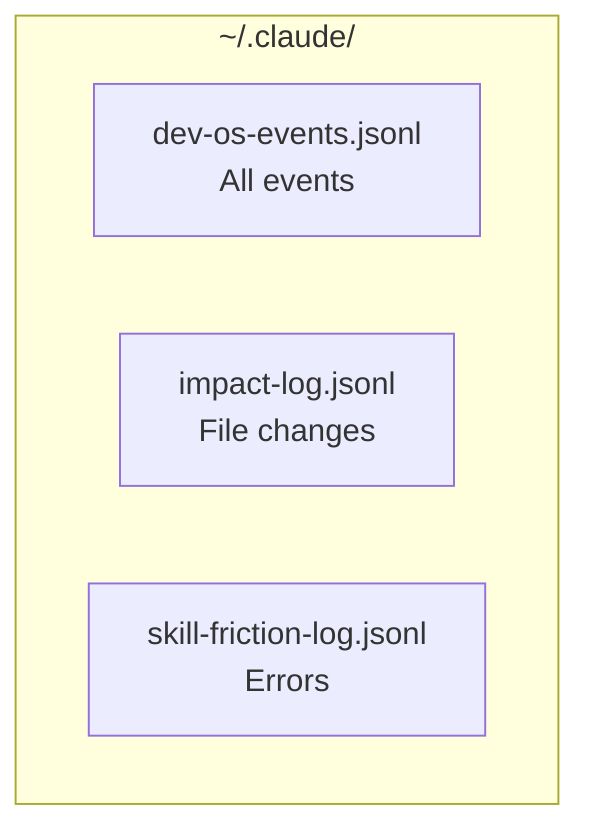

### Supporting Files

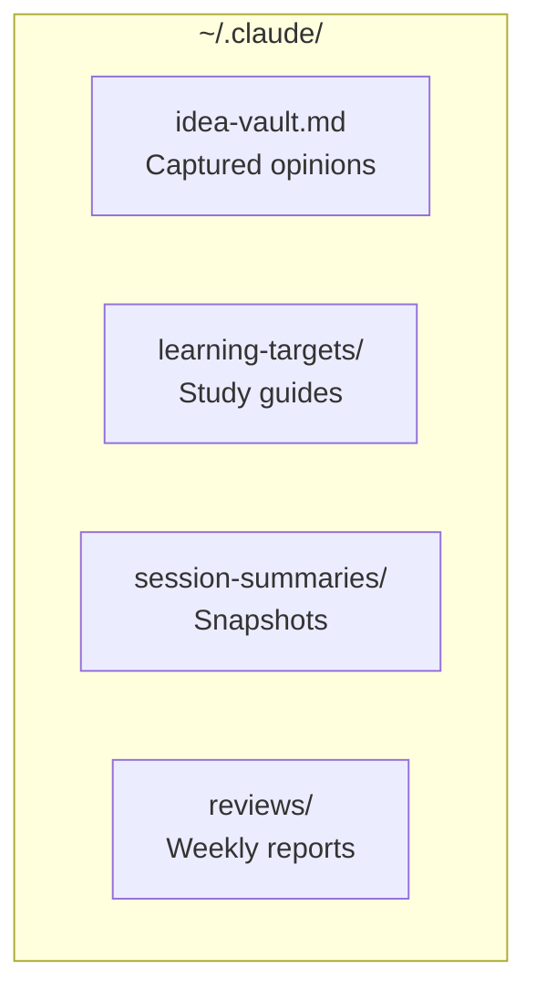

---

## Part 4: Event Schemas

### dev-os-events.jsonl

Each line contains:

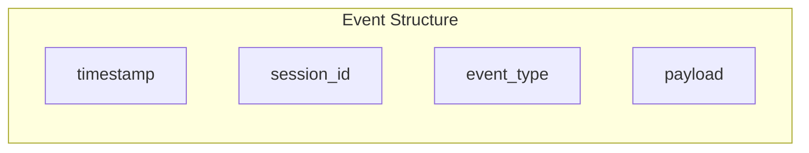

### impact-log.jsonl

Each line contains:

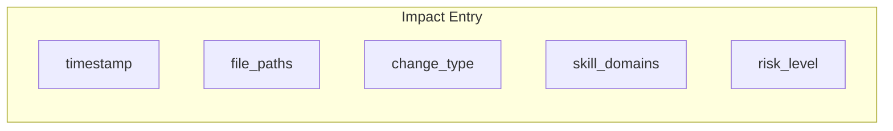

### skill-friction-log.jsonl

Each line contains:

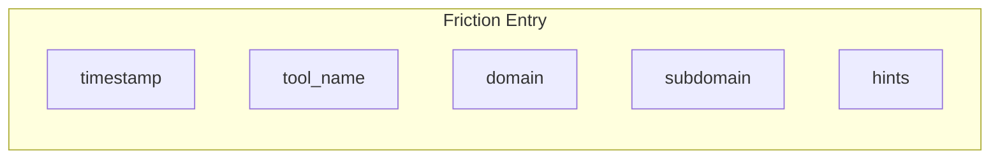

---

## Part 5: Weekly Review Pipeline

### Pipeline Overview

Four scripts run in sequence:

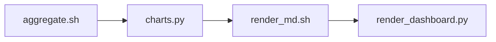

### Step 1: Aggregate

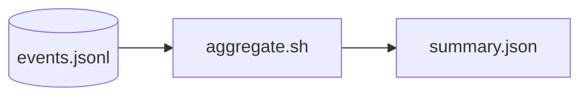

### Step 2: Visualize

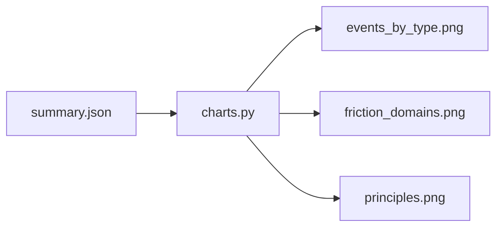

### Step 3: Template

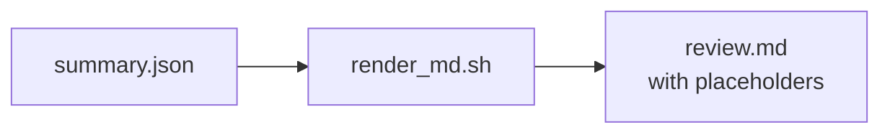

### Step 4: Render HTML

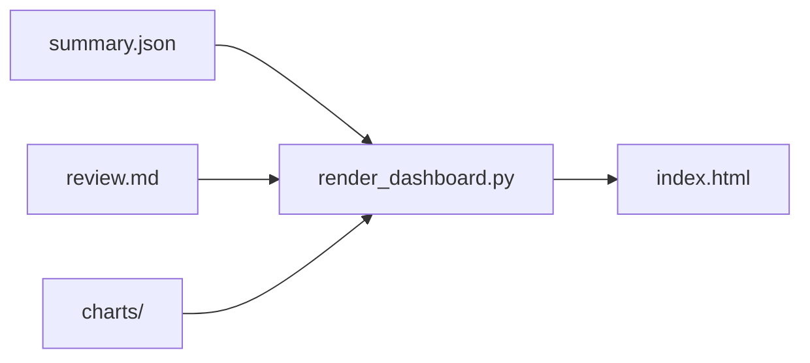

### Step 5: AI Synthesis

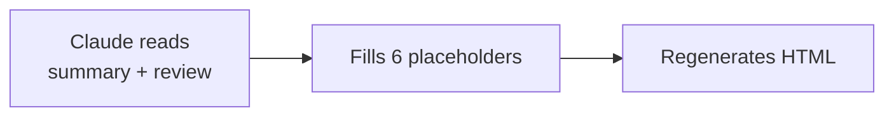

---

## Part 6: Friction Taxonomy

### Top-Level Domains

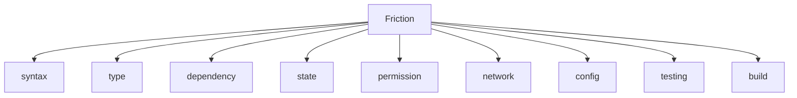

### State Subdomains

Most common friction type:

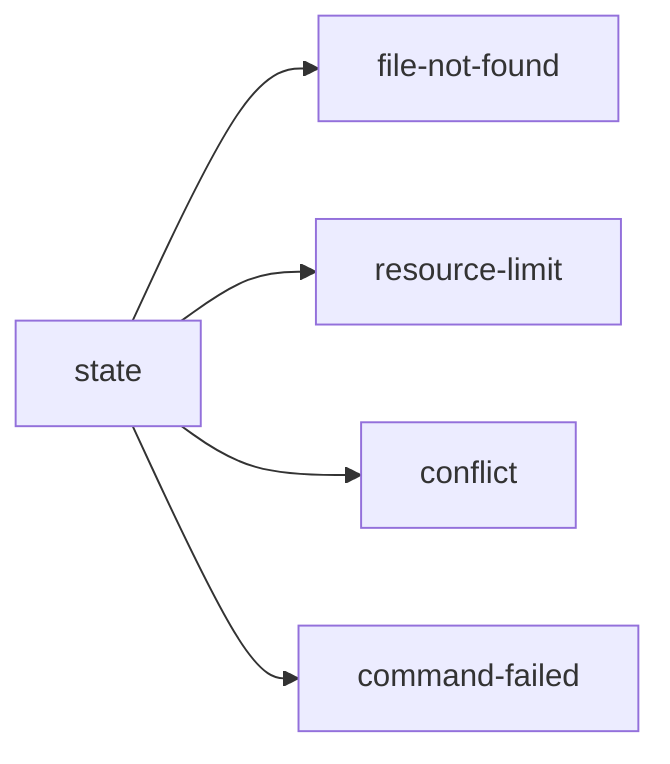

### Dependency Subdomains

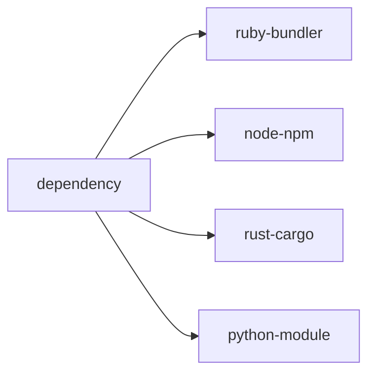

---

## Part 7: Hook Lifecycle

### Session Start

```mermaid
flowchart TB
    A[Claude starts] --> B[session-context-injector]
    B --> C[Inject recent impact/friction]
    A --> D[friction-escalator]
    D --> E[Warn if repeated errors]
```

### During Work

```mermaid
flowchart TB
    A[Edit file] --> B[impact-extractor]
    A --> C[large-diff-escalator]
    A --> D[reversal-detector]
    A --> E[async-test-runner]
```

### On Error

```mermaid
flowchart LR
    A[Tool fails] --> B[skill-gap-detector]
    B --> C[Classify error]
    C --> D[Log to friction file]
```

### Session End

```mermaid
flowchart TB
    A[Stop requested] --> B{Tests passing?}
    B -->|No| C[Block stop]
    B -->|Yes| D{Meaningful work?}
    D -->|No| E[Prompt for insight]
    D -->|Yes| F[Generate learnings]
```

---

## Related Documentation

- [Workflow Scenarios](./workflow-scenarios.md) - Common workflow examples
- [Hooks README](../hooks/README.md) - Hook implementation details
- [Weekly Review SKILL.md](../skills/common/weekly-review/SKILL.md) - Running reviews
