# Dev OS Workflow Scenarios

How telemetry captures data during common development activities.

---

## Scenario 1: Feature Development

### Starting Your Session

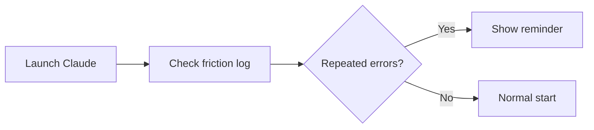

### Writing Code

Each file edit creates an event:

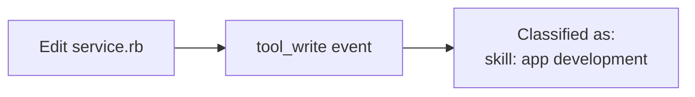

### Auto-Classification

The system guesses what kind of work you're doing:

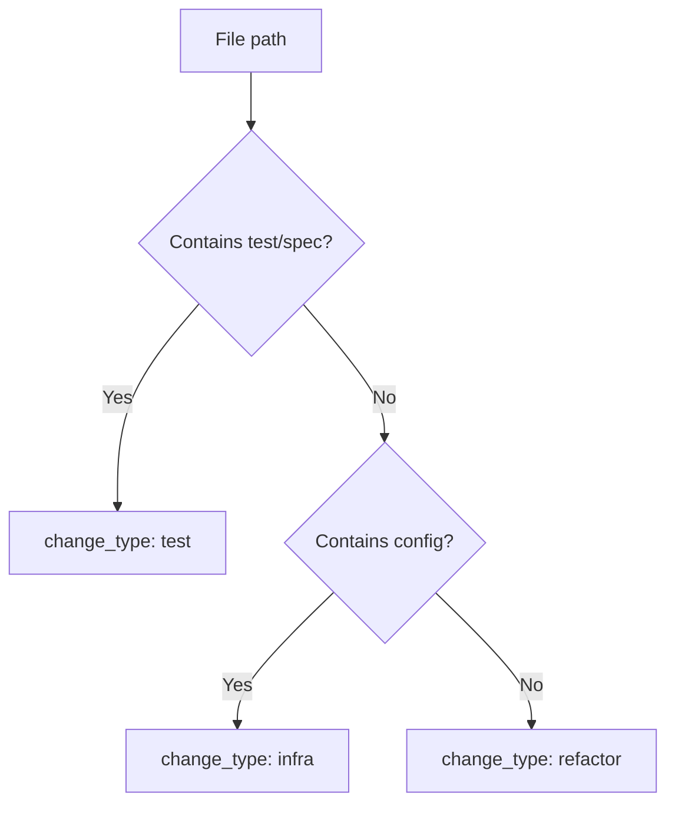

### Risk Assessment

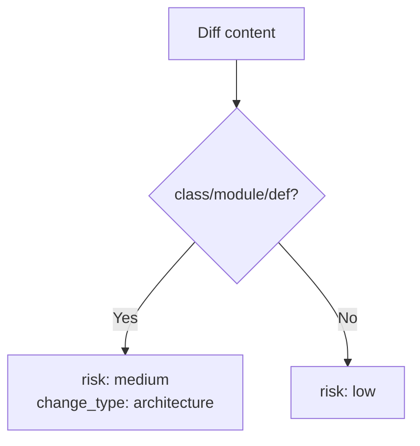

---

## Scenario 2: Large Changes

### Detection

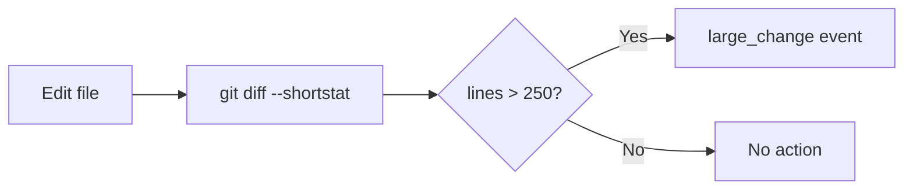

### Prompted Response

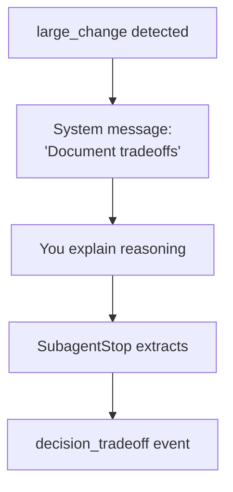

### What Gets Captured

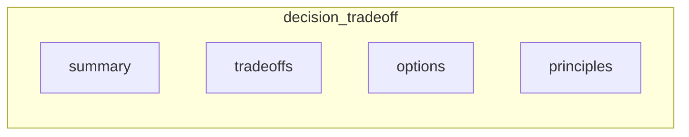

---

## Scenario 3: Debugging Errors

### Error Classification

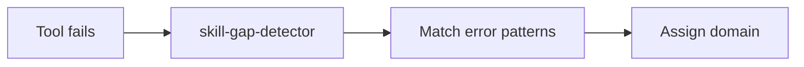

### Common: File Not Found

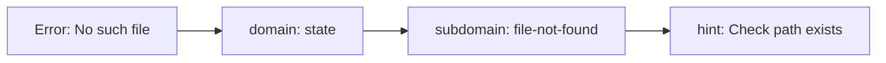

### Common: Resource Limit

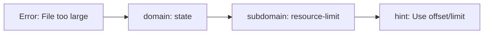

### Pattern Detection

After multiple similar errors:

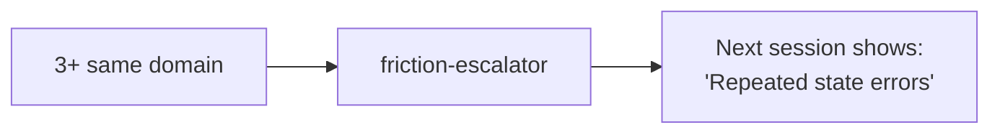

---

## Scenario 4: Running Tests

### Async Test Flow

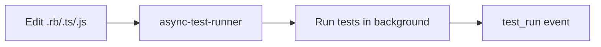

### Test Results

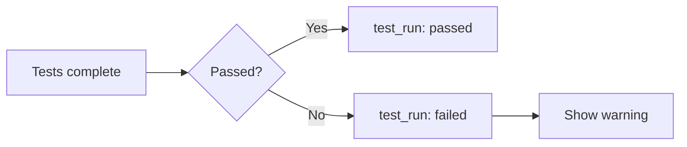

### Stop Blocking

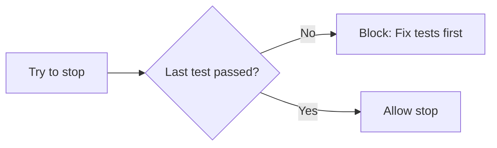

---

## Scenario 5: Completing Tasks

### Task Gate Checks

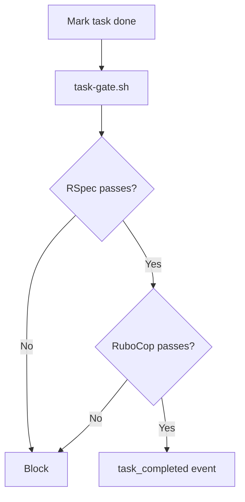

### What Gets Checked

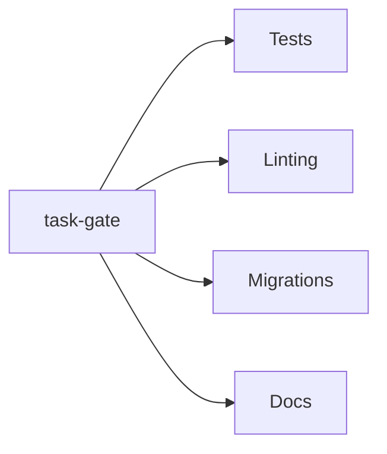

---

## Scenario 6: Dependency Updates

### Detection

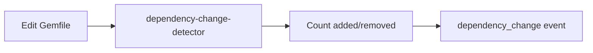

### Tracked Files

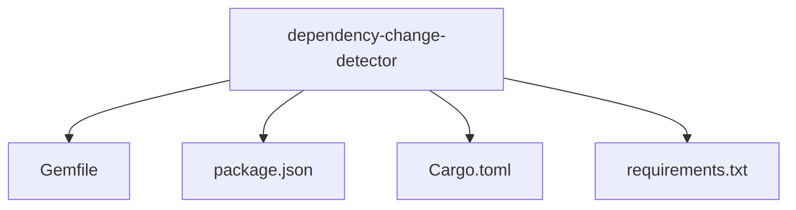

---

## Scenario 7: Code Reversals

### Detection

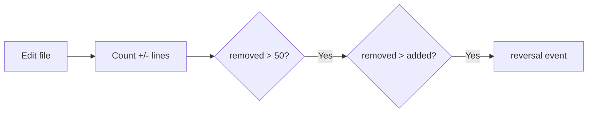

### Why Track This

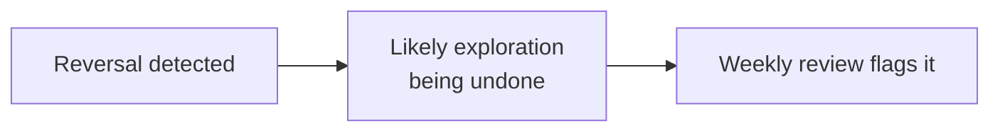

---

## Scenario 8: End of Session

### Learning Generation

```mermaid
flowchart LR
    A[Session ends] --> B[learning-suggestion-generator]
    B --> C[Read impact log]
    B --> D[Read friction log]
    C --> E[learning-targets/latest.md]
    D --> E
```

### What's Generated

```mermaid
flowchart TB
    A[latest.md] --> B[Where you're bleeding<br/>Top friction domains]
    A --> C[Where you're investing<br/>Top skill areas]
    A --> D[Precision moves<br/>Suggested actions]
```

---

## Scenario 9: Weekly Review

### Data Aggregation

```mermaid
flowchart LR
    A[7 days of events] --> B[aggregate.sh]
    B --> C[summary.json]
```

### Key Metrics Computed

```mermaid
flowchart TB
    A[summary.json] --> B[Total writes]
    A --> C[Total failures]
    A --> D[Friction domains]
    A --> E[Principles invoked]
    A --> F[Test stability]
```

### AI Analysis

```mermaid
flowchart LR
    A[summary.json] --> B[Claude analyzes]
    B --> C[Executive summary]
    B --> D[Friction analysis]
    B --> E[Impact bullets]
    B --> F[Precision moves]
```

---

## Summary: What Gets Captured

| You Do This | Event Created | Shows Up In |
|-------------|---------------|-------------|
| Edit file | tool_write | Writes count |
| Big edit (>250 lines) | large_change | Discipline flags |
| Update deps | dependency_change | Churn tracking |
| Delete lots of code | reversal | Reversal count |
| Tool fails | tool_failure | Friction analysis |
| Run tests | test_run | Test stability |
| Complete task | task_completed | Tasks count |
| Explain tradeoff | decision_tradeoff | Principles invoked |

---

## Related Documentation

- [Telemetry Architecture](./telemetry-architecture.md) - System design
- [Hooks README](../hooks/README.md) - Hook details
- [Weekly Review SKILL.md](../skills/common/weekly-review/SKILL.md) - Running reviews
